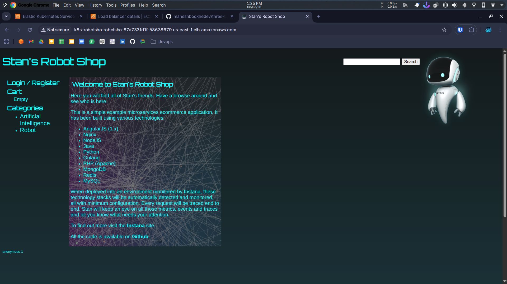
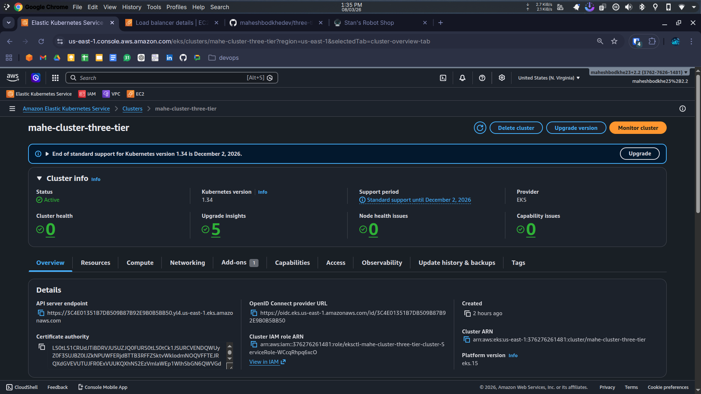
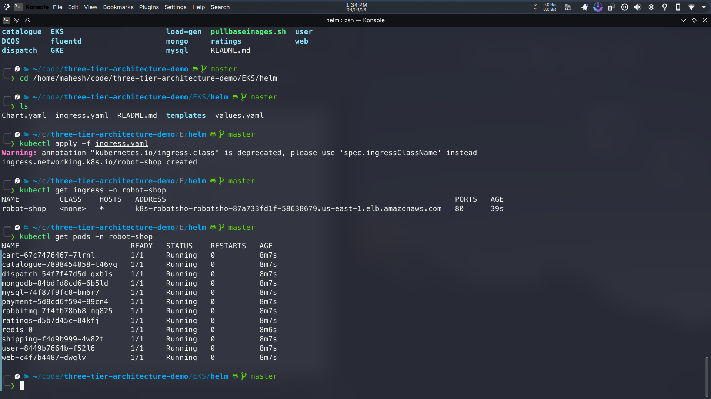
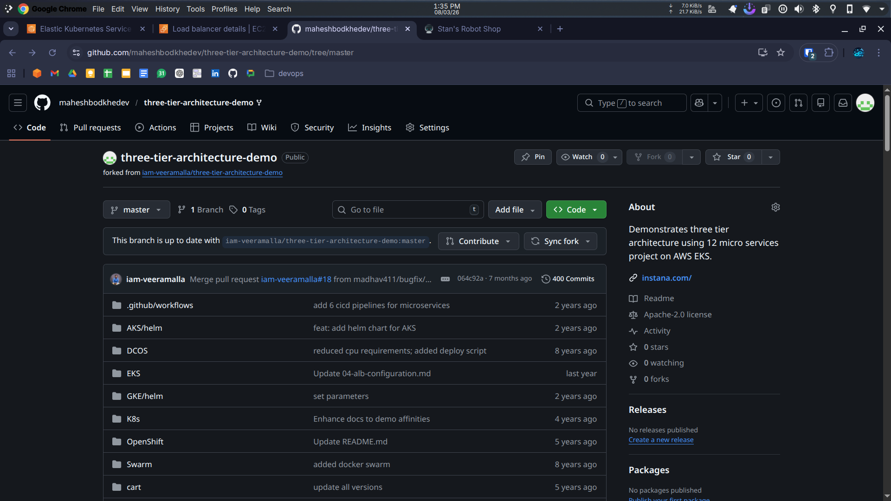

# 🚀 Three Tier Architecture Deployment on AWS EKS


---

# 📌 Project Overview

This project demonstrates how to deploy a **Three-Tier Microservices Application** on **AWS EKS (Elastic Kubernetes Service)** using **Helm** and **AWS Load Balancer Controller**.

The application used is **Robot Shop**, a microservices based demo application consisting of multiple services like:

* Web
* Cart
* User
* Catalogue
* Shipping
* Payment
* Ratings

Backend services include:

* MongoDB
* MySQL
* Redis
* RabbitMQ

All services run as **Kubernetes Pods inside an AWS EKS cluster**.

---

# 🖥 Project Website

Below is the deployed Robot Shop application running through **AWS Load Balancer**.



---

# 🏗 Architecture

The project follows a **Three-Tier Architecture**:

```text
User
 │
 ▼
AWS Application Load Balancer
 │
 ▼
Web Layer (Frontend)
 │
 ▼
Application Layer (Microservices)
 ├── Cart
 ├── User
 ├── Shipping
 ├── Payment
 └── Catalogue
 │
 ▼
Database Layer
 ├── MySQL
 ├── MongoDB
 ├── Redis
 └── RabbitMQ
```

---

# 📊 AWS Infrastructure

## EKS Cluster

Below screenshot shows the **AWS EKS Cluster created for the deployment**.



---

## AWS Load Balancer

The **AWS Load Balancer Controller** automatically created an Application Load Balancer to expose the application.


---

# 📦 Kubernetes Deployment

All microservices run as **Kubernetes Pods inside the robot-shop namespace**.



---

# 🧰 Technologies Used

| Technology         | Purpose                    |
| ------------------ | -------------------------- |
| AWS EKS            | Managed Kubernetes Service |
| Kubernetes         | Container Orchestration    |
| Docker             | Containerized Applications |
| Helm               | Kubernetes Package Manager |
| AWS ALB Controller | Load Balancer Integration  |
| AWS EBS CSI Driver | Persistent Storage         |
| Git                | Version Control            |

---

# 📂 Repository

GitHub Repository:

👉 https://github.com/maheshbodkhedev/three-tier-architecture-demo

Repository Screenshot:



---

# ⚙️ Prerequisites

Before starting, install the following tools:

* AWS CLI
* kubectl
* eksctl
* Helm
* Git

Verify installation:

```bash
aws --version
kubectl version
eksctl version
helm version
```

---

# 🚀 Step 1 — Create EKS Cluster

Create the Kubernetes cluster:

```bash
eksctl create cluster --name mahe-cluster-three-tier --region us-east-1
```

This command automatically creates:

* VPC
* Worker Nodes
* Security Groups
* Networking resources

---

# 🔐 Step 2 — Configure OIDC Provider

Set cluster variable:

```bash
export cluster_name=mahe-cluster-three-tier
```

Get OIDC ID:

```bash
oidc_id=$(aws eks describe-cluster --name $cluster_name \
--query "cluster.identity.oidc.issuer" \
--output text | cut -d '/' -f 5)
```

Check provider:

```bash
aws iam list-open-id-connect-providers | grep $oidc_id | cut -d "/" -f4
```

Associate OIDC provider:

```bash
eksctl utils associate-iam-oidc-provider \
--cluster $cluster_name \
--approve
```

---

# 🌐 Step 3 — Install AWS Load Balancer Controller

Download IAM policy:

```bash
curl -O https://raw.githubusercontent.com/kubernetes-sigs/aws-load-balancer-controller/v2.11.0/docs/install/iam_policy.json
```

Create IAM policy:

```bash
aws iam create-policy \
--policy-name AWSLoadBalancerControllerIAMPolicy \
--policy-document file://iam_policy.json
```

Create IAM service account:

```bash
eksctl create iamserviceaccount \
--cluster=mahe-cluster-three-tier \
--namespace=kube-system \
--name=aws-load-balancer-controller \
--role-name AmazonEKSLoadBalancerControllerRole \
--attach-policy-arn=<YOUR-POLICY-ARN> \
--approve
```

Install controller:

```bash
helm repo add eks https://aws.github.io/eks-charts

helm install aws-load-balancer-controller eks/aws-load-balancer-controller \
-n kube-system \
--set clusterName=mahe-cluster-three-tier \
--set serviceAccount.create=false \
--set serviceAccount.name=aws-load-balancer-controller \
--set region=us-east-1 \
--set vpcId=<YOUR-VPC-ID>
```

---

# 💾 Step 4 — Install EBS CSI Driver

Create IAM role:

```bash
eksctl create iamserviceaccount \
--name ebs-csi-controller-sa \
--namespace kube-system \
--cluster mahe-cluster-three-tier \
--role-name AmazonEKS_EBS_CSI_DriverRole \
--role-only \
--attach-policy-arn arn:aws:iam::aws:policy/service-role/AmazonEBSCSIDriverPolicy \
--approve
```

Install addon:

```bash
eksctl create addon \
--name aws-ebs-csi-driver \
--cluster mahe-cluster-three-tier \
--service-account-role-arn <ROLE-ARN> \
--force
```

---

# 📦 Step 5 — Deploy Application

Create namespace:

```bash
kubectl create ns robot-shop
```

Clone repository:

```bash
git clone https://github.com/maheshbodkhedev/three-tier-architecture-demo.git
```

Navigate to Helm chart:

```bash
cd three-tier-architecture-demo/EKS/helm
```

Install application:

```bash
helm install robot-shop --namespace robot-shop .
```

---

# 🔎 Verify Deployment

Check pods:

```bash
kubectl get pods -n robot-shop
```

Check services:

```bash
kubectl get svc -n robot-shop
```

---

# 🌍 Expose Application Using Ingress

Apply ingress:

```bash
kubectl apply -f ingress.yaml
```

Check ingress:

```bash
kubectl get ingress -n robot-shop
```

You will get an **AWS Load Balancer DNS URL** to access the application.

---

# 🧹 Cleanup

Delete the cluster:

```bash
eksctl delete cluster --name mahe-cluster-three-tier --region us-east-1
```

---

# 👨‍💻 Author

**Mahesh Bodkhe**

DevOps Engineer | Cloud Enthusiast

GitHub:
https://github.com/maheshbodkhedev

---

⭐ If you found this project helpful, please **star the repository**!
